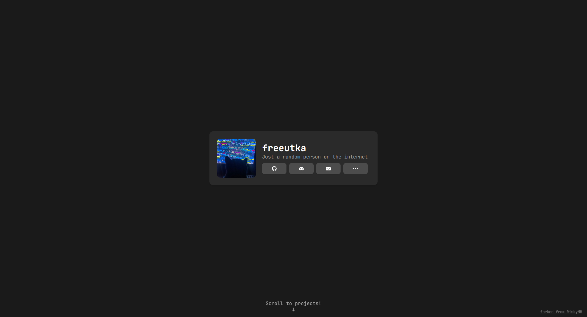

# Portfolio

Welcome to my portfolio website! This is a showcase of my work and projects.

🌐 **Live Portfolio:** [freeutka.xyz](https://freeutka.xyz)

## Preview



## About

This is my personal portfolio built with modern web technologies. Feel free to explore my projects and get in touch!

## Tech Stack

* TypeScript
* React
* Tailwind CSS

## CLI

You can also view my portfolio directly from your terminal. The CLI is a lightweight script that prints a formatted profile card.

### How it works

The CLI is built using **Bun**. The `cli/generate.ts` script handles the formatting by:

1. Defining the profile data and styling constants.
2. Generating a fixed-width terminal box using ANSI escape codes for colors and links.
3. Automatically writing the generated output to `public/cli.txt` and building an executable file.

### Usage

You can run it in two ways:

* **Via curl:**

```bash
curl freeutka.xyz
```

* **Via npx:**

```bash
npx freeutka
```

## Cloudflare + Vercel setup

If you are hosting your site on **Vercel** behind **Cloudflare**, note that Vercel automatically redirects all HTTP requests to HTTPS. This breaks terminal usage such as:

```bash
curl freeutka.xyz
```

To support HTTP requests while keeping the website on HTTPS, you can use a **Cloudflare Worker** together with a **URL Rewrite Rule**.

#### 1. Disable "Always Use HTTPS"

In Cloudflare:

* **SSL/TLS → Edge Certificates**
* Disable **Always Use HTTPS**

#### 2. Create a Worker

Create a new Worker and use:

```js
export default {
  async fetch(request) {
    const ua = request.headers.get("user-agent") || "";
    const url = new URL(request.url);

    if (
      ua.includes("curl") &&
      url.pathname === "/cli.txt"
    ) {
      return fetch("https://freeutka.xyz/cli.txt");
    }

    return fetch(request);
  }
};
```

#### 3. Create a Rewrite Rule

Go to:

**Rules → URL Rewrite Rules**

Create a rule with the expression:

```text
(http.request.uri.path eq "/" and http.user_agent contains "curl")
```

Rewrite to:

```text
Static
/cli.txt
```

This makes:

```bash
curl freeutka.xyz
```

behave as:

```bash
curl freeutka.xyz/cli.txt
```

without affecting regular browser traffic.

#### 4. Add a route

Attach the Worker to:

```text
freeutka.xyz/*
```

Now:

```bash
curl freeutka.xyz
```

will work over HTTP, while regular browsers will still be redirected to HTTPS.

## Original Repository

Forked from [RiskyMH/Website](https://github.com/RiskyMH/Website)

---

Feel free to check out the code and reach out if you have any questions! 😊